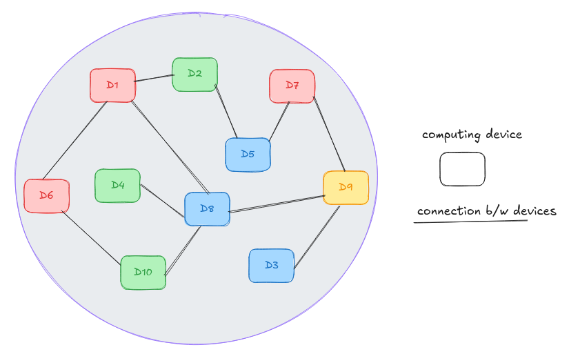
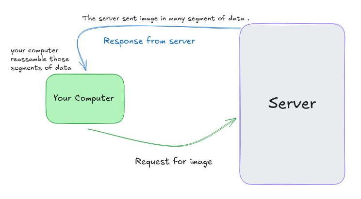
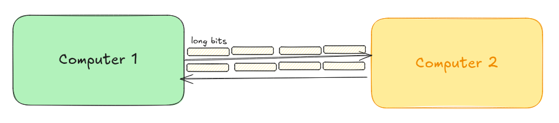

# 🌐 Computer Networking  
Welcome to the **Computer Networking Hub!** This repository is my personal project to share everything I've learned about the fascinating world of computer networks. My goal is to create a clear, easy-to-understand, and comprehensive resource for everyone.

<!-- more about contain and introduction -->

### What Is A Computer Network  

Computer Network is a system in which two or more than two computing devices intercommunicate with each othe and share resourses . 

### What Is An Internet  

The internet is a computer network that interconnect billions of computing devices throught the world .

Here is the list of some **[traditional devices](#traditional-devices)** devices or **[non-traditional devices](#non-traditional-devices)** devices  

### Traditional Devices  
-   Computers _(Desktop, Laptops, Work Stations **(Linux)** )_
-   Mobile, Tablets
-   Servers and So on ...  

### Non-Traditional Devices 
-   TVs
-   Traffic System
-   Home Automation or Home Appliences
-   Smart Watches
-   Cars and so on ... 

All these computer devices or things are connected together by a network of **communication links** or **[packet switches](#packets)** .  

This communication links are madeup of different **physical media** e.g:

-   **coaxial cable**
-   **copper wires**
-   **radio spectrum**
-   **optical fibers** 

***Different communication links can transfer data in different transmit rate***  
Transmit Rate Is Measured In **bit/sec** .  

### Packets  

In networking the data transmit over a network, and while transfer the data is broke down into ***small segment*** of **packets** that contain small amount of information or data . That is known as **packets** OR in other words, **packets** are the ***small segments*** of a ***large information*** or ***data*** .  

And these small packets are **reassamble** in the **destination system or host or end system or device** .  

**Example :**  

You are downloading an image in **your computer** form a **server** . The image *does not go* from *server* to *your computer* in **one piece** . Instead, it ***broke down*** the image into ***small data packets*** and *sent over the network* . And those data packets *travels through network wires, cabels, or radio waves of the internet* and all these data packets are ***reassembled*** by your computer into the **orignal image** .

### Why Packets Are Used ?  

It could be possible to send data and file over the internet without chopping them into small packets of information or data .  

One computer can send data or information to another computer in the form of long unbroken line of bits (small units of information, communicates as pulses of electricity that computers can interprate) .  

But this communication only happens between two computers over the network.

  

This communication becomes impractical when more than two computers involved . While the long line of bits passed over the wires between two computers, no third could use those wires to send information .  

In contrast to this approach, The internet uses **packet switching** .

-   **Packet Switching** _It refers to the ability of the networking components to process the packets independently from each other_

-   Means that the packets can take differents network paths to the same **destination** .

-   Packets follow some protocols to reach the destination in some order . Even a packet take different **route** to reach the destination .  

Because of packet switching **packets** from multiple computers can travel over the same wires in basically any order .  

This enables multiple connection take place in the same networking equipment at the same time .  

-   **As a result billions of devices can exchange data and information at the same time .**  

### Packet Header  
