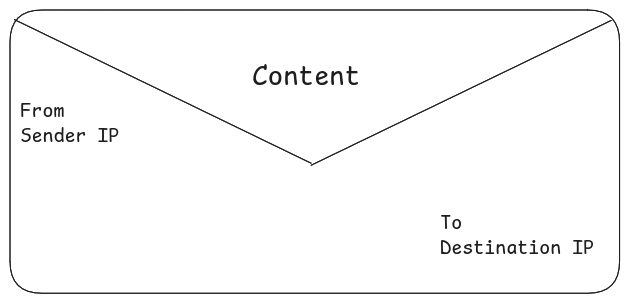

# 🌐 Computer Networking  
Welcome to the **Computer Networking Hub!** This repository is my personal project to share everything I've learned about the fascinating world of computer networks. My goal is to create a clear, easy-to-understand, and comprehensive resource for everyone.

<!-- more about contain and introduction -->

### What Is A Computer Network  

Computer Network is a system in which two or more than two computing devices intercommunicate with each othe and share resourses . 

### What Is An Internet  

The internet is a computer network that interconnect billions of computing devices throught the world .

Here is the list of some **[traditional devices](#traditional-devices)** devices or **[non-traditional devices](#non-traditional-devices)** devices  

### Traditional Devices  
-   Computers _(Desktop, Laptops, Work Stations **(Linux)** )_
-   Mobile, Tablets
-   Servers and So on ...  

### Non-Traditional Devices 
-   TVs
-   Traffic System
-   Home Automation or Home Appliences
-   Smart Watches
-   Cars and so on ... 

All these computer devices or things are connected together by a network of **communication links** or **[packet switches](#packets)** .  

This communication links are madeup of different **physical media** e.g:

-   **coaxial cable**
-   **copper wires**
-   **radio spectrum**
-   **optical fibers** 

***Different communication links can transfer data in different transmit rate***  
Transmit Rate Is Measured In **bit/sec** .  

### What Are The Data Packets ?  

Data packets are the individual information organized into one packets sent through a network path . They break down the data into separate bits to speed up the transmission from one end system to another end system . Data packets use IP (internet protocol) and allow systems to communicate via the internet and other networks by sending and receiving data packets .  

When a user sent data, files, images, audio, and text from one end system to another system, it break down into small data packets, which again reassamble at the end system once they received by the end system .    

**Example :**  

You are downloading an image in **your computer** form a **server** . The image *does not go* from *server* to *your computer* in **one piece** . Instead, it ***broke down*** the image into ***small data packets*** and *sent over the network* . And those data packets *travels through network wires, cabels, or radio waves of the internet* and all these data packets are ***reassembled*** by your computer into the **orignal image** .

  

### Why Data Packets Are Important ?  

Data packets are important because they simplyfy and speed up the process of communication . By breaking down the data into small packets, it make the transmission more efficient by giving each network in **TCP/IP** to allow data to flow into different bandwidths, send via multiple routes, fix and resend paused or lossed data.  

Without packets, the internet's user experiance would be slow . The packets allow faster speed by breaking down the data into small packets and sending the data into different routes over the internet towards the destination .  

### How Packet Structure Look Like ?

A packet is a series of bits that has three sections : 
-   **Header**
-   **Payload -(The actual data)**
-   **Trailer**  

#### Header  

The **header** of the data packets contains the information that allows for the actual transmission of the data packets.  
The header contains:-
-   IP of packet's sender (IPv4 or IPv6)
-   IP of packet's destination (IPv4 or IPv6)
-   Kind of data
-   Size of the data packet (header + payload)  

  

The header can include a 16-bits identification number so the destination computer can correctly identify and reassamble the payload from data packet. A **fragmentation** offset is another value in the header that helps with this process .  

A flag in a data packet tells the network if it can fragment the packet by sending it through a saperate network since some network have a restricted maximum size of packets they can send .  

Also the header consist of **checksum** . A value that aids in checking error and verifying that the end users received all the bits correctly . The checksum calculates all the bytes in the packet to ensure every byte is present . If not then the packet will resent . In this way the checksum reduce the margin of error.  

#### Payload  

The payload is the data, which could be a video, image, text or audio that the user sends. It makes up the bulk of the packet. If a payload has a fixed length, such as 32 bits of an IPv4 address, it inserts extra zeros to meet the length requirements.  

#### Trailer  
The trailer is optional, and data packets don’t always include it. However, it often signals the end of a packet. The trailer may consist of additional error checking, most commonly cyclical redundancy checking (CRC). It works by adding up all of the ones in the payload, storing that value in the trailer for the receiving device to do the same process, and ensuring each byte is present.  

